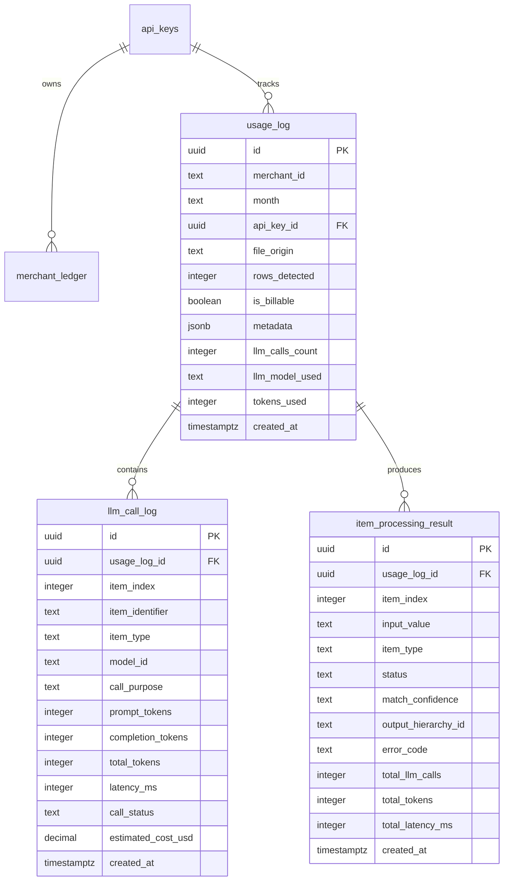
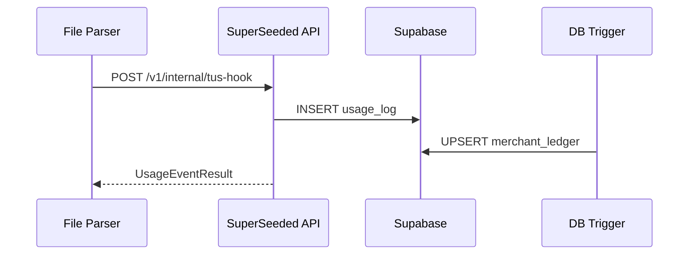
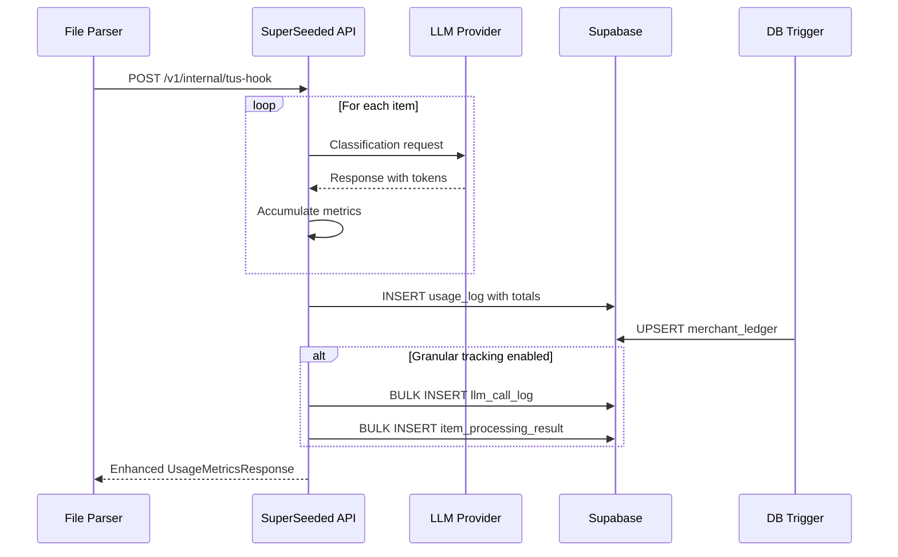

# Usage Metrics Output System Design

## Overview

This document outlines the design for a comprehensive usage metrics output system for observability when platform integrators provide files (CSV, TXT, JSON, etc.) to the SuperSeeded API. The system enables tracking of LLM calls per quotation line item or species taxon, supporting billing, analytics, and operational visibility.

## Current State Analysis

### Existing Infrastructure

**Database Schema (from migrations):**
- [`usage_log`](../api/supabase/migrations/001_billing_schema.sql:53) - Audit trail with basic LLM metrics
- [`merchant_ledger`](../api/supabase/migrations/001_billing_schema.sql:10) - Monthly billing aggregates
- LLM columns added in [`003_add_llm_metrics_to_usage_log.sql`](../api/supabase/migrations/003_add_llm_metrics_to_usage_log.sql:9):
  - `llm_calls_count` - Total LLM calls per file
  - `llm_model_used` - Primary model identifier
  - `tokens_used` - Total tokens consumed

**Current API Response (from [`UsageEventResult`](../api/models/billing.py:51)):**
```python
class UsageEventResult(BaseModel):
    is_billable: bool
    rows_processed: int
    file_origin: str
    usage: Optional[UsageMetrics]  # rows_processed, llm_calls, metrics_per_item
    current_month_totals: Optional[MonthlyTotals]
```

### Gap Analysis

| Current Capability | Gap | Required Enhancement |
|-------------------|-----|---------------------|
| Aggregate LLM calls per file | No per-item granularity | Track LLM calls per line item |
| Single model tracking | No multi-model support | Track multiple models per request |
| Basic metrics dict | No processing timing | Add latency/duration metrics |
| No item-level failures | Silent failures aggregated | Track success/failure per item |
| No file type tracking | Unknown input format | Track file MIME type |

---

## 1. Enhanced API Response Structure

### Proposed `UsageMetricsResponse` Schema

```json
{
  "success": true,
  "request_id": "req_a1b2c3d4e5f6",
  "processing": {
    "started_at": "2026-01-23T00:30:00.000Z",
    "completed_at": "2026-01-23T00:30:02.450Z",
    "duration_ms": 2450,
    "file_type": "text/csv",
    "file_size_bytes": 4096
  },
  "usage": {
    "is_billable": true,
    "rows_processed": 42,
    "rows_succeeded": 40,
    "rows_failed": 2,
    "file_origin": "external",
    "llm_summary": {
      "total_calls": 105,
      "total_tokens": 15750,
      "models_used": ["gpt-4o", "gpt-4o-mini"],
      "average_calls_per_item": 2.5,
      "average_tokens_per_item": 375
    }
  },
  "billing": {
    "month": "2026-01",
    "merchant_is_active": true,
    "month_row_count": 542,
    "month_billable_row_count": 500,
    "quota_remaining": 458,
    "estimated_overage_cost": 0.00
  },
  "enriched_data": [
    {
      "item_index": 0,
      "input_label": "400mm AS",
      "status": "success",
      "llm_calls": 2,
      "tokens_used": 350,
      "processing_ms": 58,
      "standard_data": { ... }
    },
    {
      "item_index": 1,
      "input_label": "Unknown Pot",
      "status": "failed",
      "error_code": "NO_MATCH",
      "error_message": "Could not determine pot size category",
      "llm_calls": 3,
      "tokens_used": 450,
      "processing_ms": 120
    }
  ]
}
```

### Response Field Definitions

| Field | Type | Description | Returned When |
|-------|------|-------------|---------------|
| `request_id` | string | Unique identifier for this processing request | Always |
| `processing.duration_ms` | integer | Total server-side processing time | Always |
| `processing.file_type` | string | Detected MIME type | Always |
| `usage.rows_succeeded` | integer | Items successfully processed | Always |
| `usage.rows_failed` | integer | Items that failed processing | Always |
| `usage.llm_summary.models_used` | array | List of models invoked | Always |
| `billing.*` | object | Billing context | Teams plan only |
| `enriched_data[].llm_calls` | integer | LLM calls for this specific item | When `include_item_metrics=true` |
| `enriched_data[].processing_ms` | integer | Processing time for this item | When `include_item_metrics=true` |

### Request Parameter: `include_item_metrics`

Platform integrators can opt-in to receive per-item LLM metrics:

```bash
POST /v1/internal/tus-hook?include_item_metrics=true
```

**Default: `false`** - Reduces response payload size for high-volume integrators.

---

## 2. Database Schema for Granular LLM Tracking

### New Table: `llm_call_log`

Captures individual LLM invocations for detailed observability and cost allocation.

```sql
-- Migration: 004_llm_call_tracking.sql

CREATE TABLE IF NOT EXISTS llm_call_log (
    -- Primary Key
    id UUID PRIMARY KEY DEFAULT gen_random_uuid(),
    
    -- Foreign Keys
    usage_log_id UUID NOT NULL REFERENCES usage_log(id) ON DELETE CASCADE,
    
    -- Item Context
    item_index INTEGER NOT NULL,           -- Position in the input array (0-indexed)
    item_identifier TEXT,                  -- Original input label/SKU for debugging
    item_type TEXT NOT NULL DEFAULT 'quotation_line_item',  -- 'quotation_line_item' | 'species_taxon'
    
    -- LLM Call Details
    model_id TEXT NOT NULL,                -- e.g., 'gpt-4o', 'gpt-4o-mini', 'claude-3-opus'
    call_purpose TEXT NOT NULL,            -- e.g., 'classification', 'enrichment', 'validation'
    prompt_tokens INTEGER NOT NULL DEFAULT 0,
    completion_tokens INTEGER NOT NULL DEFAULT 0,
    total_tokens INTEGER GENERATED ALWAYS AS (prompt_tokens + completion_tokens) STORED,
    
    -- Timing
    latency_ms INTEGER,                    -- Time to receive response from LLM
    
    -- Result
    call_status TEXT NOT NULL DEFAULT 'success',  -- 'success' | 'error' | 'timeout' | 'rate_limited'
    error_message TEXT,                    -- Populated on failure
    
    -- Cost Tracking (for internal analytics)
    estimated_cost_usd DECIMAL(10, 6),     -- Based on model pricing at time of call
    
    -- Timestamp
    created_at TIMESTAMPTZ NOT NULL DEFAULT NOW(),
    
    -- Constraints
    CONSTRAINT llm_call_log_call_status_check CHECK (
        call_status IN ('success', 'error', 'timeout', 'rate_limited')
    ),
    CONSTRAINT llm_call_log_item_type_check CHECK (
        item_type IN ('quotation_line_item', 'species_taxon', 'unknown')
    )
);

-- Indexes for common query patterns
CREATE INDEX idx_llm_call_log_usage_log_id ON llm_call_log(usage_log_id);
CREATE INDEX idx_llm_call_log_model_id ON llm_call_log(model_id);
CREATE INDEX idx_llm_call_log_created_at ON llm_call_log(created_at);
CREATE INDEX idx_llm_call_log_item_type ON llm_call_log(item_type);
CREATE INDEX idx_llm_call_log_call_status ON llm_call_log(call_status) WHERE call_status != 'success';

-- Composite index for per-item aggregations
CREATE INDEX idx_llm_call_log_usage_item ON llm_call_log(usage_log_id, item_index);

-- Enable RLS
ALTER TABLE llm_call_log ENABLE ROW LEVEL SECURITY;

-- RLS Policy: Inherit access from parent usage_log
CREATE POLICY "Inherit access from usage_log"
    ON llm_call_log
    FOR SELECT
    USING (
        usage_log_id IN (
            SELECT id FROM usage_log ul
            WHERE ul.api_key_id IN (
                SELECT ak.id FROM api_keys ak WHERE ak.user_id = auth.uid()
            )
        )
    );

-- Comments
COMMENT ON TABLE llm_call_log IS 'Granular log of individual LLM API calls for observability and cost tracking';
COMMENT ON COLUMN llm_call_log.item_type IS 'Type of item: quotation_line_item for pot sizes, species_taxon for botanical names';
COMMENT ON COLUMN llm_call_log.call_purpose IS 'Semantic purpose: classification, enrichment, validation, retry';
```

### New Table: `item_processing_result`

Captures the outcome for each processed item, enabling per-item analytics.

```sql
CREATE TABLE IF NOT EXISTS item_processing_result (
    -- Primary Key
    id UUID PRIMARY KEY DEFAULT gen_random_uuid(),
    
    -- Foreign Keys
    usage_log_id UUID NOT NULL REFERENCES usage_log(id) ON DELETE CASCADE,
    
    -- Item Identity
    item_index INTEGER NOT NULL,
    input_value TEXT NOT NULL,             -- Original input string
    item_type TEXT NOT NULL DEFAULT 'quotation_line_item',
    
    -- Processing Result
    status TEXT NOT NULL,                  -- 'success' | 'partial' | 'failed' | 'skipped'
    match_confidence TEXT,                 -- 'Exact' | 'High' | 'Medium' | 'Low' | 'None'
    output_hierarchy_id TEXT,              -- Resolved category ID (if successful)
    
    -- Error Details
    error_code TEXT,                       -- Standardized error code
    error_message TEXT,
    
    -- Aggregated Metrics (denormalized for performance)
    total_llm_calls INTEGER NOT NULL DEFAULT 0,
    total_tokens INTEGER NOT NULL DEFAULT 0,
    total_latency_ms INTEGER NOT NULL DEFAULT 0,
    
    -- Timestamp
    created_at TIMESTAMPTZ NOT NULL DEFAULT NOW(),
    
    -- Constraints
    CONSTRAINT item_processing_result_status_check CHECK (
        status IN ('success', 'partial', 'failed', 'skipped')
    ),
    
    -- Unique constraint: one result per item per processing event
    CONSTRAINT item_processing_result_unique UNIQUE (usage_log_id, item_index)
);

-- Indexes
CREATE INDEX idx_item_processing_result_usage_log ON item_processing_result(usage_log_id);
CREATE INDEX idx_item_processing_result_status ON item_processing_result(status);
CREATE INDEX idx_item_processing_result_confidence ON item_processing_result(match_confidence);

-- Enable RLS (same policy pattern as llm_call_log)
ALTER TABLE item_processing_result ENABLE ROW LEVEL SECURITY;

CREATE POLICY "Inherit access from usage_log"
    ON item_processing_result
    FOR SELECT
    USING (
        usage_log_id IN (
            SELECT id FROM usage_log ul
            WHERE ul.api_key_id IN (
                SELECT ak.id FROM api_keys ak WHERE ak.user_id = auth.uid()
            )
        )
    );
```

### Schema Diagram



---

## 3. Integration with Existing Billing System

### Current Billing Flow



### Enhanced Flow with Granular Tracking



### Stripe Integration Points

#### Current State
- Stripe integration is planned but not implemented
- [`billing-schema.md`](../docs/architecture/billing-schema.md:226) notes: "Stripe Integration: Store `stripe_invoice_id` on `merchant_ledger` after billing"

#### Recommended Integration

**Option A: Usage Records API (Metered Billing)**

```python
# services/stripe_billing.py

async def report_usage_to_stripe(
    merchant_id: str,
    subscription_item_id: str,
    quantity: int,
    timestamp: datetime
) -> None:
    """
    Report usage to Stripe for metered billing.
    
    Called:
    1. After each file processing (real-time)
    2. Daily batch for reconciliation
    """
    stripe.UsageRecord.create(
        subscription_item=subscription_item_id,
        quantity=quantity,  # billable_row_count
        timestamp=int(timestamp.timestamp()),
        action='increment'  # or 'set' for daily reconciliation
    )
```

**Option B: Invoice Items (End-of-Month)**

```python
async def create_monthly_invoice_items(
    api_key_id: str,
    month: str
) -> None:
    """
    Create Stripe invoice items at end of billing period.
    
    Based on:
    - Active merchant count × $15 base fee
    - Overage rows × $0.01 per row
    - LLM token overage (future)
    """
    merchants = await get_merchant_usage_summary(supabase, api_key_id, month)
    
    for merchant in merchants:
        if merchant['is_active']:
            # Base fee
            stripe.InvoiceItem.create(
                customer=platform_customer_id,
                amount=1500,  # $15.00 in cents
                currency='usd',
                description=f"Active merchant: {merchant['merchant_id']}"
            )
            
            # Overage
            overage = max(0, merchant['billable_row_count'] - 500)
            if overage > 0:
                stripe.InvoiceItem.create(
                    customer=platform_customer_id,
                    amount=overage,  # $0.01 per row
                    currency='usd',
                    description=f"Overage: {overage} rows for {merchant['merchant_id']}"
                )
```

#### Database Additions for Stripe Integration

```sql
-- Add to merchant_ledger
ALTER TABLE merchant_ledger 
ADD COLUMN IF NOT EXISTS stripe_invoice_id TEXT,
ADD COLUMN IF NOT EXISTS stripe_invoice_item_ids JSONB DEFAULT '[]'::jsonb,
ADD COLUMN IF NOT EXISTS invoiced_at TIMESTAMPTZ;

-- Add to api_keys (Platform level)
ALTER TABLE api_keys
ADD COLUMN IF NOT EXISTS stripe_customer_id TEXT,
ADD COLUMN IF NOT EXISTS stripe_subscription_id TEXT;
```

### LLM Cost Tracking for Future Billing

The `llm_call_log.estimated_cost_usd` column enables future LLM cost pass-through:

```sql
-- Calculate LLM costs per merchant per month
SELECT 
    ul.merchant_id,
    ul.month,
    SUM(lcl.estimated_cost_usd) AS total_llm_cost,
    SUM(lcl.total_tokens) AS total_tokens,
    COUNT(DISTINCT lcl.model_id) AS models_used
FROM usage_log ul
JOIN llm_call_log lcl ON lcl.usage_log_id = ul.id
WHERE ul.api_key_id = $1 AND ul.month = $2
GROUP BY ul.merchant_id, ul.month;
```

---

## 4. Observability Tooling Recommendations

### Logging Strategy

#### Structured Log Format

```json
{
  "level": "info",
  "timestamp": "2026-01-23T00:30:02.450Z",
  "service": "superseeded-api",
  "event": "file_processed",
  "request_id": "req_a1b2c3d4e5f6",
  "merchant_id": "merchant_12345",
  "api_key_id": "key_xyz789",
  "metrics": {
    "rows_processed": 42,
    "rows_succeeded": 40,
    "rows_failed": 2,
    "llm_calls": 105,
    "tokens_used": 15750,
    "duration_ms": 2450
  },
  "billing": {
    "is_billable": true,
    "file_origin": "external"
  }
}
```

#### Log Levels by Event Type

| Event | Level | When |
|-------|-------|------|
| File received | `info` | Always |
| Processing started | `debug` | High verbosity |
| LLM call made | `debug` | High verbosity |
| LLM call failed | `warn` | Always |
| Item processed | `debug` | High verbosity |
| Item failed | `warn` | Always |
| File completed | `info` | Always |
| Billing recorded | `info` | Always |

### Metrics Collection

#### Recommended Metrics (Prometheus-style)

```
# Request metrics
superseeded_requests_total{merchant_id, file_type, status} counter
superseeded_request_duration_seconds{merchant_id} histogram

# LLM metrics
superseeded_llm_calls_total{model, purpose, status} counter
superseeded_llm_tokens_total{model, token_type} counter
superseeded_llm_latency_seconds{model} histogram
superseeded_llm_cost_dollars{model} counter

# Item processing metrics
superseeded_items_processed_total{status, item_type, confidence} counter
superseeded_items_processing_seconds{item_type} histogram

# Billing metrics
superseeded_billable_rows_total{merchant_id} counter
superseeded_active_merchants{api_key_id, month} gauge
```

#### Implementation with FastAPI

```python
# middleware/metrics.py

from prometheus_client import Counter, Histogram, Gauge

# Counters
llm_calls_total = Counter(
    'superseeded_llm_calls_total',
    'Total LLM API calls',
    ['model', 'purpose', 'status']
)

llm_tokens_total = Counter(
    'superseeded_llm_tokens_total',
    'Total LLM tokens used',
    ['model', 'token_type']
)

# Histograms
request_duration = Histogram(
    'superseeded_request_duration_seconds',
    'Request processing time',
    ['merchant_id'],
    buckets=[0.1, 0.5, 1.0, 2.5, 5.0, 10.0]
)

llm_latency = Histogram(
    'superseeded_llm_latency_seconds',
    'LLM API latency',
    ['model'],
    buckets=[0.1, 0.25, 0.5, 1.0, 2.0, 5.0]
)
```

### Dashboard Recommendations

#### Platform Integrator Dashboard (Customer-Facing)

| Panel | Visualization | Data Source |
|-------|---------------|-------------|
| Monthly Usage Summary | Stat | `merchant_ledger` |
| Rows Processed (7 days) | Time series | `usage_log` |
| Success Rate by File Type | Pie chart | `usage_log + metadata` |
| Top Merchants by Usage | Table | `merchant_ledger` aggregated |
| LLM Costs Trend | Line chart | `llm_call_log` aggregated |

#### Internal Operations Dashboard

| Panel | Visualization | Alert Threshold |
|-------|---------------|-----------------|
| LLM Error Rate | Gauge | > 5% |
| P95 Processing Latency | Time series | > 5s |
| Token Usage (hourly) | Bar chart | > 1M/hour |
| Failed Items Rate | Gauge | > 10% |
| Model Usage Distribution | Pie chart | - |
| Cost per Request | Histogram | > $0.10 average |

### Alerting Rules

```yaml
# alerting_rules.yml

groups:
  - name: superseeded-api
    rules:
      - alert: HighLLMErrorRate
        expr: rate(superseeded_llm_calls_total{status="error"}[5m]) / rate(superseeded_llm_calls_total[5m]) > 0.05
        for: 2m
        labels:
          severity: warning
        annotations:
          summary: "LLM error rate above 5%"
          
      - alert: HighProcessingLatency
        expr: histogram_quantile(0.95, superseeded_request_duration_seconds_bucket) > 5
        for: 5m
        labels:
          severity: warning
        annotations:
          summary: "P95 latency exceeds 5 seconds"
          
      - alert: UnusualTokenConsumption
        expr: rate(superseeded_llm_tokens_total[1h]) > 1000000
        for: 10m
        labels:
          severity: info
        annotations:
          summary: "Token consumption exceeds 1M tokens/hour"
```

### Recommended Tooling Stack

| Category | Recommended Tool | Rationale |
|----------|-----------------|-----------|
| **Metrics** | Supabase + Prometheus | Native PostgreSQL aggregation + standard metrics |
| **Logging** | Structured JSON → Axiom/Datadog | Immutable, searchable logs |
| **Tracing** | OpenTelemetry → Jaeger | Distributed tracing for debugging |
| **Dashboards** | Supabase Studio + Grafana | Built-in + custom visualizations |
| **Alerting** | Grafana Alerting / PagerDuty | Flexible routing and escalation |

---

## 5. Webhook Callbacks for Async Processing

### Use Case

For large files (>100 items), processing may exceed typical HTTP timeout thresholds. Webhook callbacks enable async notification.

### Proposed Webhook Payload

```json
{
  "event": "file.processed",
  "request_id": "req_a1b2c3d4e5f6",
  "timestamp": "2026-01-23T00:30:02.450Z",
  "merchant_id": "merchant_12345",
  "status": "completed",
  "processing": {
    "duration_ms": 12500,
    "file_type": "application/pdf"
  },
  "usage": {
    "rows_processed": 250,
    "rows_succeeded": 248,
    "rows_failed": 2,
    "is_billable": true
  },
  "data_url": "https://api.superseeded.ai/v1/results/req_a1b2c3d4e5f6",
  "expires_at": "2026-01-24T00:30:02.450Z"
}
```

### Webhook Registration

```sql
-- Add to api_keys table
ALTER TABLE api_keys
ADD COLUMN IF NOT EXISTS webhook_url TEXT,
ADD COLUMN IF NOT EXISTS webhook_secret TEXT,
ADD COLUMN IF NOT EXISTS webhook_events TEXT[] DEFAULT ARRAY['file.processed'];
```

### Implementation Notes

1. **Signing**: All webhooks signed with `HMAC-SHA256` using `webhook_secret`
2. **Retry**: 3 attempts with exponential backoff (1s, 5s, 30s)
3. **Data Retrieval**: Full `enriched_data` available at `data_url` for 24 hours
4. **Event Types**: `file.processed`, `file.failed`, `quota.exceeded`

---

## 6. Updated Pydantic Models

### `models/billing.py` Additions

```python
from datetime import datetime
from typing import Optional, List, Literal
from pydantic import BaseModel, Field


class LLMCallMetrics(BaseModel):
    """Metrics for a single LLM API call."""
    model_id: str
    call_purpose: Literal['classification', 'enrichment', 'validation', 'retry']
    prompt_tokens: int
    completion_tokens: int
    latency_ms: int
    status: Literal['success', 'error', 'timeout', 'rate_limited']
    error_message: Optional[str] = None


class ItemProcessingMetrics(BaseModel):
    """Processing metrics for a single item (quotation line item or species taxon)."""
    item_index: int
    input_value: str
    item_type: Literal['quotation_line_item', 'species_taxon']
    status: Literal['success', 'partial', 'failed', 'skipped']
    match_confidence: Optional[Literal['Exact', 'High', 'Medium', 'Low', 'None']] = None
    llm_calls: int = 0
    tokens_used: int = 0
    processing_ms: int = 0
    error_code: Optional[str] = None
    error_message: Optional[str] = None


class LLMUsageSummary(BaseModel):
    """Aggregate LLM usage for a processing request."""
    total_calls: int = Field(..., description="Total number of LLM API calls made")
    total_tokens: int = Field(..., description="Total tokens consumed")
    models_used: List[str] = Field(..., description="List of model IDs invoked")
    average_calls_per_item: float = Field(..., description="Mean LLM calls per item")
    average_tokens_per_item: float = Field(..., description="Mean tokens per item")


class ProcessingMetadata(BaseModel):
    """Timing and file metadata for a processing request."""
    started_at: datetime
    completed_at: datetime
    duration_ms: int
    file_type: str = Field(..., description="Detected MIME type")
    file_size_bytes: Optional[int] = None


class EnhancedUsageMetrics(BaseModel):
    """Full observability metrics for API responses."""
    is_billable: bool
    rows_processed: int
    rows_succeeded: int
    rows_failed: int
    file_origin: str
    llm_summary: LLMUsageSummary


class BillingContext(BaseModel):
    """Billing context returned to Teams plan users."""
    month: str
    merchant_is_active: bool
    month_row_count: int
    month_billable_row_count: int
    quota_remaining: int
    estimated_overage_cost: float = 0.0


class EnhancedUsageEventResult(BaseModel):
    """Enhanced response for file processing with full observability."""
    success: bool
    request_id: str
    processing: ProcessingMetadata
    usage: EnhancedUsageMetrics
    billing: Optional[BillingContext] = None
    enriched_data: List[dict]  # Can include ItemProcessingMetrics when requested
```

---

## 7. Implementation Checklist

### Phase 1: Core Metrics Enhancement
- [ ] Update [`UsageMetrics`](../api/models/billing.py:41) model with `rows_succeeded`, `rows_failed`
- [ ] Add `request_id` generation (UUID or prefixed string)
- [ ] Add timing instrumentation to [`process_usage_event()`](../api/services/billing.py:39)
- [ ] Include `file_type` detection from metadata

### Phase 2: Database Schema
- [ ] Create migration `004_llm_call_tracking.sql` with `llm_call_log` table
- [ ] Create migration `005_item_processing_result.sql`
- [ ] Add indexes and RLS policies
- [ ] Update [`_insert_usage_log()`](../api/services/billing.py:126) to return inserted ID

### Phase 3: Granular Tracking
- [ ] Implement `LLMCallTracker` class for per-call instrumentation
- [ ] Update enrichment service to record per-item metrics
- [ ] Add bulk insert for `llm_call_log` entries
- [ ] Add `include_item_metrics` query parameter

### Phase 4: Stripe Integration
- [ ] Add `stripe_customer_id` to `api_keys` table
- [ ] Implement usage reporting to Stripe Metered Billing
- [ ] Add monthly reconciliation job
- [ ] Store `stripe_invoice_id` on `merchant_ledger`

### Phase 5: Observability Tooling
- [ ] Add Prometheus metrics endpoint `/metrics`
- [ ] Configure structured logging format
- [ ] Create Grafana dashboard templates
- [ ] Set up alerting rules

### Phase 6: Webhook Callbacks
- [ ] Add `webhook_url` and `webhook_secret` to `api_keys`
- [ ] Implement async webhook delivery with signing
- [ ] Add retry queue for failed deliveries
- [ ] Create webhook management API endpoints

---

## Summary

This design extends the existing SuperSeeded billing infrastructure to provide comprehensive observability for platform integrators processing files through the API. Key enhancements include:

1. **Enhanced API Response**: Detailed metrics including per-item LLM tracking, processing times, and success/failure rates
2. **Granular Database Schema**: New `llm_call_log` and `item_processing_result` tables for detailed analytics
3. **Stripe Integration**: Clear path to metered billing with usage reporting
4. **Observability Stack**: Structured logging, Prometheus metrics, and dashboard recommendations
5. **Async Webhooks**: Support for large file processing with callback notifications

The phased implementation approach allows incremental delivery while maintaining backward compatibility with existing integrations.
