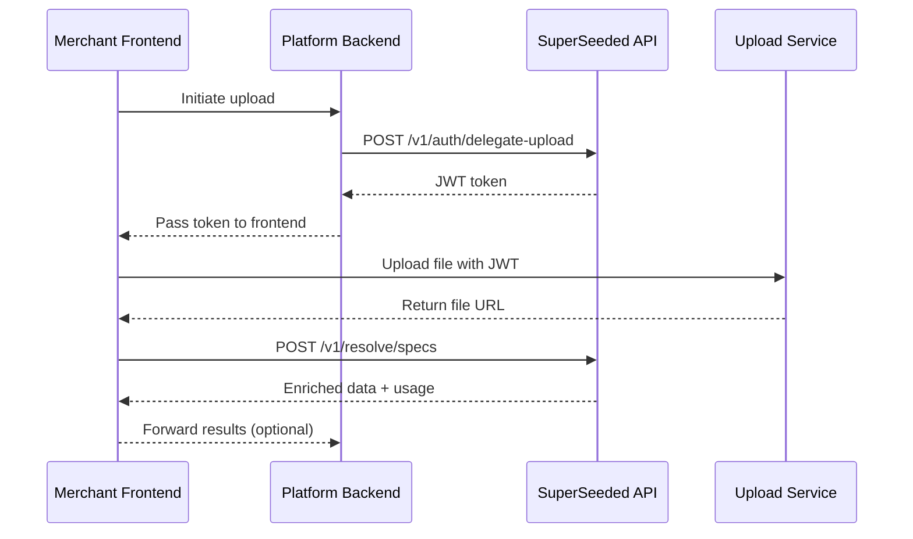

## What is a platform?

A **Platform** is a third-party integrator that wholesales the SuperSeeded AI API to their own merchants. Platforms act as intermediaries, providing their merchants with plant schedule processing capabilities without those merchants needing direct API access.

<CardGroup cols={2}>
  <Card title="Document processing" icon="bolt">
    Suppliers can digitize a 500-line PDF quote in seconds.
  </Card>
  <Card title="White-label ready" icon="browser">
    The upload experience lives entirely on your domain. Your users never leave your dashboard.
  </Card>
</CardGroup>

<Info>
  Platforms are billed based on their merchants' usage, with a per-active-merchant model plus row-based overage charges.
</Info>

## Integration architecture

## How it works

<Steps>
  <Step title="Delegate token">
    Your backend requests a short-lived JWT token for a specific merchant using the [Upload Delegation](/platform-integration/upload-delegation) endpoint.
  </Step>
  <Step title="Secure upload">
    Your frontend uses this token to authenticate direct uploads to our TUS upload service. After upload completes, you receive the file URL.
  </Step>
  <Step title="Call resolve-specs">
    Your frontend calls `POST /v1/resolve/specs` with the file URL. The API fetches the file internally and processes it.
  </Step>
  <Step title="Receive enriched data">
    The API returns processed data directly in the response, including enriched line items and usage billing information.
  </Step>
</Steps>

## Key concepts

### Merchants

Merchants are your end customers. Each merchant is identified by a `merchant_id` that you provide. This ID is used to:

- Track usage and bill based on active merchants
- Partition data and quotas

### Billable vs non-billable

Not all document processing counts toward billing. See [Usage & Billing](/platform-integration/usage-billing) for details on:

- Active merchant billing model and row counting
- Quotas and the SuperSeeded Engine exemption

## Next steps

<CardGroup cols={2}>
  <Card title="Upload delegation" icon="key" href="/platform-integration/upload-delegation">
    Generate secure tokens for merchant uploads
  </Card>
  <Card title="Usage & billing" icon="receipt" href="/platform-integration/usage-billing">
    Understand how usage is tracked and billed
  </Card>
  <Card title="Resolve specs from upload" icon="sparkles" href="/platform-integration/tus-webhook">
    Process uploads and get enriched data
  </Card>
</CardGroup>
