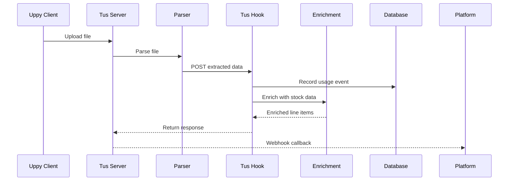

## Internal Webhook

<Note>
  This endpoint is called internally after a file is uploaded and parsed. It's documented here for transparency about the processing flow and to help you understand the webhook response your platform receives.
</Note>

**Endpoint:** `POST /v1/internal/tus-hook`

## Processing Flow



<Steps>
  <Step title="File Upload">
    File uploaded via Tus server using the delegated JWT token.
  </Step>
  <Step title="Parsing">
    Parser extracts structured JSON from the uploaded plant schedule.
  </Step>
  <Step title="Webhook Trigger">
    Internal webhook receives extracted data with JWT claims.
  </Step>
  <Step title="Usage Recording">
    Usage event is recorded against the merchant's ledger. See [Usage & Billing](/platform-integration/usage-billing).
  </Step>
  <Step title="Stock Enrichment">
    Line items are matched against stock database and enriched with availability.
  </Step>
  <Step title="Response">
    Enriched data returned to the Platform via callback.
  </Step>
</Steps>

## Request Schema

The internal webhook receives the following payload:

| Field | Type | Description |
|-------|------|-------------|
| `file_path` | string | Path to the uploaded file in storage |
| `merchant_id` | string | Merchant identifier from JWT claim |
| `api_key_id` | string | Platform API key identifier from JWT claim |
| `extracted_data` | object | Parsed file content |

### Extracted Data Structure

```json
{
  "file_metadata": {
    "filename": "plant_schedule_jan2024.xlsx",
    "producer": null,
    "upload_timestamp": "2024-01-20T12:00:00Z"
  },
  "line_items": [
    {
      "row_number": 1,
      "botanical_name": "Acacia cognata",
      "common_name": "River Wattle",
      "pot_size": "200mm",
      "quantity": 50
    }
  ]
}
```

<ResponseField name="file_metadata.producer" type="string | null">
  If set to `"SuperSeeded_Engine_v1"`, the document is marked as non-billable.
</ResponseField>

## Response

The webhook returns enriched data with usage information:

```json
{
  "success": true,
  "usage": {
    "is_billable": true,
    "rows_processed": 42,
    "file_origin": "external",
    "month_totals": {
      "month": "2024-01",
      "is_active": true,
      "row_count": 142,
      "billable_row_count": 100
    }
  },
  "enriched_data": [
    {
      "line_item": {
        "row_number": 1,
        "botanical_name": "Acacia cognata",
        "common_name": "River Wattle",
        "pot_size": "200mm",
        "quantity": 50
      },
      "stock_status": "IN_STOCK",
      "available_quantity": 120,
      "matched_supplier": "Green Nursery Co"
    }
  ]
}
```

### Response Fields

<ResponseField name="success" type="boolean" required>
  Whether processing completed successfully
</ResponseField>

<ResponseField name="usage" type="object" required>
  Usage metrics for this processing event
</ResponseField>

<ResponseField name="usage.is_billable" type="boolean">
  Whether this document counts toward billing
</ResponseField>

<ResponseField name="usage.rows_processed" type="integer">
  Number of line items processed in this file
</ResponseField>

<ResponseField name="usage.file_origin" type="string">
  Either `"external"` or `"superseed_engine"`
</ResponseField>

<ResponseField name="usage.month_totals" type="object">
  Cumulative usage for the current billing month
</ResponseField>

<ResponseField name="enriched_data" type="array" required>
  Array of enriched line items with stock information
</ResponseField>

### Stock Status Values

| Status | Description |
|--------|-------------|
| `IN_STOCK` | Item available from matched supplier |
| `LOW_STOCK` | Limited availability (< 20% of requested quantity) |
| `OUT_OF_STOCK` | Item not currently available |
| `NOT_FOUND` | No matching item in stock database |

### Enriched Line Item Fields

<ResponseField name="line_item" type="object">
  Original parsed line item data
</ResponseField>

<ResponseField name="stock_status" type="string">
  Current availability status
</ResponseField>

<ResponseField name="available_quantity" type="integer | null">
  Number of units available (null if NOT_FOUND)
</ResponseField>

<ResponseField name="matched_supplier" type="string | null">
  Supplier name if matched (null if NOT_FOUND)
</ResponseField>

## Error Responses

| Status | Error | Description |
|--------|-------|-------------|
| `400` | `invalid_payload` | Missing required fields in request |
| `401` | `invalid_token` | JWT token validation failed |
| `422` | `parsing_failed` | Could not extract data from file |
| `500` | `enrichment_error` | Stock enrichment service unavailable |

## Webhook Retry Policy

<Info>
  If your platform's webhook endpoint is unavailable, we retry with exponential backoff: 1 minute, 5 minutes, 30 minutes. After 3 failures, the webhook is marked as failed and can be retrieved via the API.
</Info>
