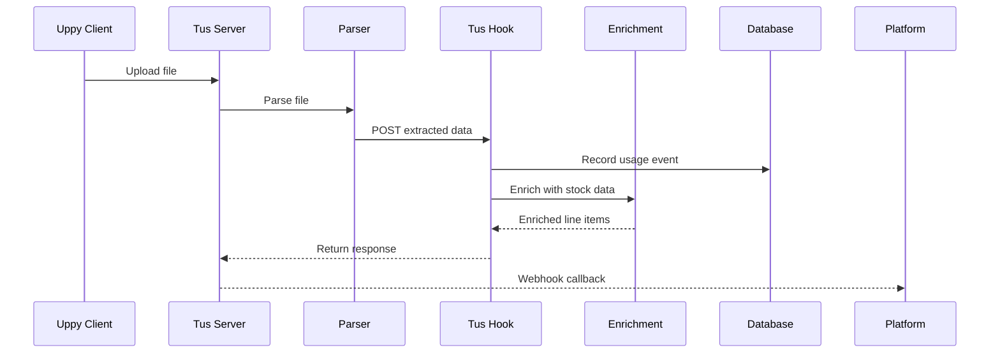

## Internal Webhook

<Note>
  This endpoint is called internally after a file is uploaded and parsed. It's documented here for transparency about the processing flow and to help you understand the webhook response your platform receives.
</Note>

**Endpoint:** `POST /v1/internal/tus-hook`

## Processing Flow



<Steps>
  <Step title="File Upload">
    File uploaded via Tus server using the delegated JWT token.
  </Step>
  <Step title="Parsing">
    Parser extracts structured JSON from the uploaded plant schedule.
  </Step>
  <Step title="Webhook Trigger">
    Internal webhook receives extracted data with JWT claims.
  </Step>
  <Step title="Usage Recording">
    Usage event is recorded against the merchant's ledger. See [Usage & Billing](/platform-integration/usage-billing).
  </Step>
  <Step title="Stock Enrichment">
    Line items are matched against stock database and enriched with availability.
  </Step>
  <Step title="Response">
    Enriched data returned to the Platform via callback.
  </Step>
</Steps>

## Request Schema

The internal webhook receives the following payload:

| Field | Type | Description |
|-------|------|-------------|
| `file_path` | string | Path to the uploaded file in storage |
| `merchant_id` | string | Merchant identifier from JWT claim |
| `api_key_id` | string | Platform API key identifier from JWT claim |
| `extracted_data` | object | Parsed file content |

### Extracted Data Structure

```json
{
  "file_metadata": {
    "filename": "plant_schedule_jan2024.xlsx",
    "producer": null,
    "upload_timestamp": "2024-01-20T12:00:00Z"
  },
  "line_items": [
    {
      "row_number": 1,
      "botanical_name": "Acacia cognata",
      "common_name": "River Wattle",
      "pot_size": "200mm",
      "quantity": 50
    }
  ]
}
```

<ResponseField name="file_metadata.producer" type="string | null">
  If set to `"SuperSeeded_Engine_v1"`, the document is marked as non-billable.
</ResponseField>

## Response

The webhook returns enriched data with usage information:

```json
{
  "success": true,
  "usage": {
    "is_billable": true,
    "rows_processed": 42,
    "file_origin": "external",
    "month_totals": {
      "month": "2024-01",
      "is_active": true,
      "row_count": 142,
      "billable_row_count": 100
    }
  },
  "enriched_data": {
    "results": [
      {
        "input_label": "400mm AS",
        "match_confidence": "High",
        "standard_data": {
          "id": "4.1",
          "evergreen_connect_potsize_id": [
            61,
            79,
            81,
            91,
            96,
            103,
            105,
            111,
            114,
            119,
            123,
            125,
            127,
            129,
            133,
            134,
            138,
            149,
            151,
            153,
            155,
            158,
            162,
            166,
            171,
            179,
            185,
            189,
            193,
            200,
            206,
            351,
            370,
            407,
            408,
            409,
            410,
            411,
            434,
            452,
            470,
            471,
            530,
            531,
            587,
            606,
            634,
            644,
            721,
            727,
            748,
            781,
            796
          ],
          "type": "Pot - Air Pruning",
          "stage_order": 4,
          "stage_name": "Advanced Production",
          "is_biological": true,
          "matching_strategy": "Volume",
          "logistics": {
            "tier": "Pallet",
            "is_stackable": false,
            "freight_efficiency": "Medium"
          },
          "quality_profile": {
            "transplant_shock_risk": "Very Low",
            "seasonal_restriction": "None",
            "inspection_focus": "Desiccation"
          },
          "customer_note": "Superior root structure; requires more frequent watering until planted."
        },
        "external_ids": null
      }
    ]
  }
}
```

### Response Fields

<ResponseField name="success" type="boolean" required>
  Whether processing completed successfully
</ResponseField>

<ResponseField name="usage" type="object" required>
  Usage metrics for this processing event
</ResponseField>

<ResponseField name="usage.is_billable" type="boolean">
  Whether this document counts toward billing
</ResponseField>

<ResponseField name="usage.rows_processed" type="integer">
  Number of line items processed in this file
</ResponseField>

<ResponseField name="usage.file_origin" type="string">
  Either `"external"` or `"superseed_engine"`
</ResponseField>

<ResponseField name="usage.month_totals" type="object">
  Cumulative usage for the current billing month
</ResponseField>

<ResponseField name="enriched_data" type="object" required>
  Spec resolution results containing aligned plant specifications
</ResponseField>

<ResponseField name="enriched_data.results" type="array" required>
  Array of resolved spec objects with standard data
</ResponseField>

### Spec Resolution Result Fields

<ResponseField name="input_label" type="string">
  The original raw text label that was resolved
</ResponseField>

<ResponseField name="match_confidence" type="string">
  Confidence level of the match: `"Exact"`, `"High"`, `"Medium"`, or `"Low"`
</ResponseField>

<ResponseField name="standard_data" type="object">
  Structured biological concept data
</ResponseField>

<ResponseField name="standard_data.id" type="string">
  Unique identifier for this specification
</ResponseField>

<ResponseField name="standard_data.evergreen_connect_potsize_id" type="integer[]">
  Array of associated EvergreenConnect pot size IDs
</ResponseField>

<ResponseField name="standard_data.type" type="string">
  Container type classification
</ResponseField>

<ResponseField name="standard_data.stage_order" type="integer">
  Maturity stage number (0-5)
</ResponseField>

<ResponseField name="standard_data.stage_name" type="string">
  Human-readable maturity stage name
</ResponseField>

<ResponseField name="standard_data.is_biological" type="boolean">
  Whether this represents a biological growth stage
</ResponseField>

<ResponseField name="standard_data.matching_strategy" type="string">
  Strategy used for matching: `"Volume"`, `"Volume/Weight"`, `"Volume Critical (Wildcard)"`, etc.
</ResponseField>

<ResponseField name="standard_data.logistics" type="object">
  Freight and handling constraints
</ResponseField>

<ResponseField name="standard_data.quality_profile" type="object">
  Risk and handling information
</ResponseField>

<ResponseField name="standard_data.customer_note" type="string">
  Human-readable guidance for handling
</ResponseField>

<ResponseField name="external_ids" type="object | null">
  External system identifiers (currently null)
</ResponseField>

## Error Responses

| Status | Error | Description |
|--------|-------|-------------|
| `400` | `invalid_payload` | Missing required fields in request |
| `401` | `invalid_token` | JWT token validation failed |
| `422` | `parsing_failed` | Could not extract data from file |
| `500` | `enrichment_error` | Stock enrichment service unavailable |

## Webhook Retry Policy

<Info>
  If your platform's webhook endpoint is unavailable, we retry with exponential backoff: 1 minute, 5 minutes, 30 minutes. After 3 failures, the webhook is marked as failed and can be retrieved via the API.
</Info>
